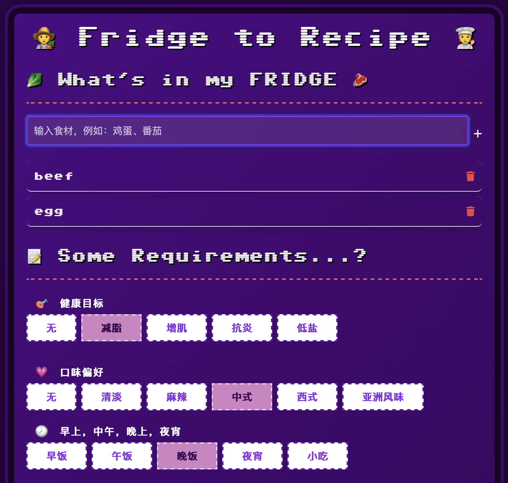

# 🧑‍🌾 Fridge to Recipe 🧑‍🍳 - Make something creative with what you had in your fridge

### 💗 [Fridge to Recipe](https://fridge-to-recipe.onrender.com) 💗



### [➡️ 中文版介绍跳转](#chinese)

## Main Features
#### ✅ Recording and managing the ingredients in your fridge. 
- Type what you had in the fridge, from fresh groceries to seasonings 🥬🧂
- We support any language!
#### ✅ Generating AI-powered recipes based on available ingredients, health goals, taste preferences, allergies etc.
- Choose your health goals (Lose weight, Anti-inflammatory, etc.) 
- Choose your taste preferences (Spicy, Chinese, Western, etc.)
- Choose your meal type (Breakfast, Lunch, Dinner, Snacks, etc.)
- Choose your allergies (Nuts, Seafood, Gluten, etc.)
#### ✅ Adapting to user needs, including a special VIP code for personalized responses.
- Add extra comments to the recipe ✍️
- If you don't like the recipe, 🪄 let the recipe magic happens again! 

## Project Structure
```
📁 my-ai-recipe-app
├── app.py              # Main Flask application
├── fridge.db           # SQLite database
├── templates/
│   ├── index.html      # Frontend page
├── static/
│   ├── images/         # Stores website screenshots
│   ├── style.css       # CSS styles
├── .env                # Stores OpenAI API Key
├── requirements.txt    # Dependencies
└── README.md           # This file
```

## Tech Stack
- **Flask** - Backend web framework.
- **SQLite** - Database for storing ingredients.
- **OpenAI API** - Generates recipe suggestions.
- **HTML + CSS** - Frontend design.

## Conclusion
This is a personal project exploring AI applications in daily life. Feel free to share your thoughts! 🚀


# 从冰箱到餐桌 <a id="chinese"></a>
## 主要功能  
#### ✅ 记录和管理冰箱中的食材  
- 输入你冰箱里的食材，从新鲜食材到调味品 🥬🧂  
- 支持任何语言！  

#### ✅ 基于现有食材、健康目标、口味偏好、过敏原等生成 AI 智能食谱  
- 选择你的健康目标（减重、抗炎等）  
- 选择你的口味偏好（辣味、中餐、西餐等）  
- 选择你的餐食类型（早餐、午餐、晚餐、小吃等）  
- 选择你的过敏原（坚果、海鲜、麸质等）  

#### ✅ 适应用户需求，包括专属 VIP 代码，实现个性化推荐  
- 可以为食谱添加额外备注 ✍️  
- 如果不喜欢食谱，🪄 让 AI 重新生成魔法食谱！  

## 项目结构  
```
📁 my-ai-recipe-app
├── app.py              # 主 Flask 应用程序
├── fridge.db           # SQLite 数据库
├── templates/
│   ├── index.html      # 前端页面
├── static/
│   ├── images/         # 存储网站截图
│   ├── style.css       # CSS 样式
├── .env                # 存储 OpenAI API Key
├── requirements.txt    # 依赖文件
└── README.md           # 本文件
```

## 技术栈  
- **Flask** - 后端 Web 框架  
- **SQLite** - 存储食材的数据库  
- **OpenAI API** - 生成食谱推荐  
- **HTML + CSS** - 前端设计  

## 结论  
这是一个探索 AI 在日常生活中应用的个人项目。欢迎分享你的想法！🚀


